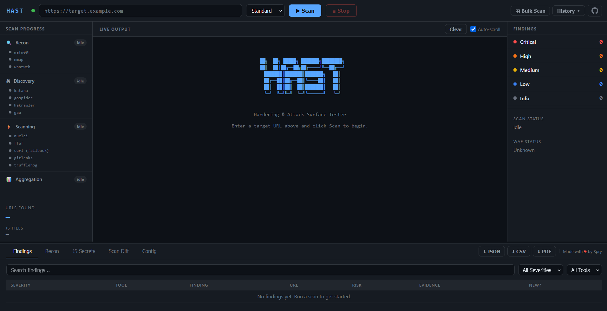

# HAST — Hardening & Attack Surface Tester

A web-based security hardening scanner with a live dashboard. Point it at a URL, pick a scan profile, and get a unified findings report across environment leaks, secret exposure, misconfigurations, SSL/TLS issues, missing security headers, CORS/CSP problems, and CVE detection based on fingerprinted stack.

Built for local use. No cloud, no accounts, no data leaves your machine.

---

## Dashboard



| Panel | What it shows |
|---|---|
| **Top bar** | Target URL input · Scan profile · Start/Stop · WAF indicator |
| **Left** | Per-phase and per-tool live status (queued / running / done / skipped / failed) |
| **Center** | Streaming terminal output from every tool, color-coded by stream |
| **Right** | Live severity counters (Critical / High / Medium / Low / Info) + new-finding badge |
| **Findings tab** | Full findings table — filterable by severity, tool, keyword — expandable rows with evidence and remediation |
| **Recon tab** | nmap port table · whatweb tech fingerprint · WAF/CDN detection result |
| **JS Secrets tab** | Secrets found in JavaScript files |
| **Scan Diff tab** | New vs resolved findings compared to the previous scan on the same target |
| **Tools tab** | Run any individual tool on demand — paste a target, fill tool-specific params, stream live output |
| **Config tab** | Paths, rate limits, profile defaults, tool availability status |

---

## Scan Profiles

| Profile | What runs |
|---|---|
| **Quick** | wafw00f + whatweb + nuclei exposures + ffuf priority paths. No crawl. Fast. |
| **Standard** | Full workflow · katana + gau · moderate rate limits |
| **Deep** | All crawlers · headless nuclei · full ffuf wordlist · lowest rate limits |

---

## What It Scans For

- Environment file leaks (`.env`, `appsettings.json`, `web.config`, `wp-config.php`, …)
- Secret and token exposure in pages and JavaScript files
- Backup and log file exposure
- SSL/TLS misconfigurations and weak protocols
- Missing security headers (HSTS, CSP, X-Frame-Options, …)
- CORS and CSP misconfigurations
- Clickjacking and subdomain takeover
- Default login panels and admin interfaces
- CVEs matched against fingerprinted stack (via nuclei `tech` templates)
- Open ports and exposed internal services (via nmap)

---

## Scan Workflow

```
Phase 1 — Recon       wafw00f → cdncheck → nmap → asnmap → tlsx → whatweb
Phase 2 — Discovery   subfinder → dnsx → [alterx + shuffledns (deep)] → naabu
                       → katana + gospider + hakrawler (parallel) → gau → urlfinder
                       → httpx (live-probe all discovered URLs) → dedup
Phase 3 — Scanning    nuclei (all discovered URLs) → ffuf (path bruteforce, auto-calibrated)
                       → JS secret scan (regex + gitleaks on every JS file)
Phase 4 — Aggregation dedup by (url, name) → risk scoring → diff vs last scan → SQLite
```

WAF detected → rate limits automatically increased, user warned in UI.
CDN detected → flagged in UI (asnmap + tlsx findings still run for infrastructure recon).
Non-standard ports found by nmap → probed by nuclei and curl too.

---

## Tools Used

HAST wraps these tools. Each is detected automatically from `PATH`. Missing tools are skipped with a warning — the scan continues with whatever is available.

**Recon**

| Tool | Source | Purpose |
|---|---|---|
| `wafw00f` | pip | WAF detection — runs first, adjusts rate limits |
| `cdncheck` | PDTM | CDN detection (Cloudflare, Akamai, Fastly, …) |
| `nmap` | apt | Port scanning and service fingerprinting |
| `asnmap` | PDTM | ASN and IP range lookup |
| `tlsx` | PDTM | TLS/SSL certificate analysis and weakness detection |
| `whatweb` | gem | Technology fingerprinting |

**Discovery**

| Tool | Source | Purpose |
|---|---|---|
| `subfinder` | PDTM | Passive subdomain enumeration |
| `dnsx` | PDTM | DNS resolution of discovered hosts |
| `alterx` | PDTM | Subdomain permutation generation (deep profile) |
| `shuffledns` | PDTM | Brute-force DNS resolution of permutations (deep profile) |
| `naabu` | PDTM | Fast port scanning of resolved subdomains |
| `katana` | PDTM | Primary web crawler (depth 3–4) |
| `gospider` | GitHub | Parallel web crawler (standard + deep) |
| `hakrawler` | GitHub | Additional crawler (deep profile) |
| `gau` | GitHub | Historical URLs from Wayback/CommonCrawl/AlienVault |
| `urlfinder` | PDTM | Passive URL discovery from JS and sitemaps |
| `httpx` | PDTM | Live HTTP probing of all discovered endpoints |

**Scanning**

| Tool | Source | Purpose |
|---|---|---|
| `nuclei` | PDTM | CVE, misconfiguration, and exposure scanning |
| `ffuf` | GitHub | Directory and file bruteforce (auto-calibrated soft-404 filter) |
| `gitleaks` | GitHub | Secret scanning in JavaScript files |
| `trufflehog` | GitHub | Alternative secret scanner |
| `curl` | apt | Manual path probe fallback when ffuf is missing |

All tools run inside Docker — nothing needs to be installed on the host.

---

## Requirements

- **Docker** (with Compose plugin v2, or standalone `docker-compose` v1)
- Nothing else — Python, Go tools, and all security tools run inside the container

---

## Quick Start

```bash
git clone <repo-url> hast
cd hast

# Build image and start (first run takes ~5–10 minutes to download tools)
./start.sh
```

Dashboard opens automatically at **http://localhost:8765**

```bash
./start.sh --detach     # run in background
./start.sh --logs       # tail logs
./start.sh --build      # force rebuild (e.g. after updating tool versions)
./start.sh --down       # stop and remove container
```

Or use Docker Compose directly:

```bash
docker compose up --build     # build + start
docker compose up -d          # background
docker compose logs -f hast
docker compose down
```

---

## Configuration

Settings are in `config.yaml` and can also be changed in the **Config tab** of the dashboard at runtime.

| Setting | Default | Notes |
|---|---|---|
| `nuclei_templates_path` | auto-detect | Checks `$NUCLEI_TEMPLATES` → `~/.local/nuclei-templates` → `/nuclei-templates` |
| `seclists_path` | auto-detect | Checks `/usr/share/seclists` → `~/seclists` |
| `rate_limit_ms` | `150` | Delay between requests (ms) |
| `waf_rate_limit_ms` | `500` | Delay when WAF is detected |
| `default_profile` | `standard` | `quick` / `standard` / `deep` |
| `respect_robots` | `true` | Honour `robots.txt` |

To mount a local SecLists install into the container, uncomment this line in `docker-compose.yml`:

```yaml
# - /usr/share/seclists:/seclists:ro
```

Then set `seclists_path: /seclists` in the Config tab.

---

## Export

From the Findings tab export buttons:

| Format | Contents |
|---|---|
| **JSON** | Full scan metadata + all findings |
| **CSV** | Summary table (severity, tool, name, URL, risk score, evidence, remediation) |
| **PDF** | Executive summary + severity breakdown + findings table with remediation |

---

## Data Storage

Scan results are stored in a SQLite database (`hast.db`) mounted as a Docker volume. History persists across container restarts and rebuilds. The **Scan Diff** tab automatically compares each new scan against the previous completed scan for the same target.

---

## Architecture

| Layer | Technology |
|---|---|
| Backend | Python 3.12 · FastAPI · aiosqlite |
| Real-time streaming | WebSocket (tool stdout/stderr streamed live to browser) |
| Frontend | Vanilla JS · HTML/CSS · no build step |
| Database | SQLite (scan history, findings, URL lists, phase checkpoints) |
| Container | Docker multi-stage build — Go tools downloaded at build time |

---

## License

MIT
